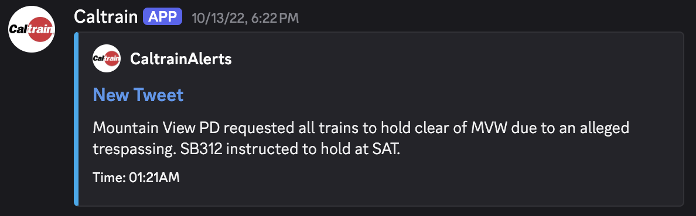
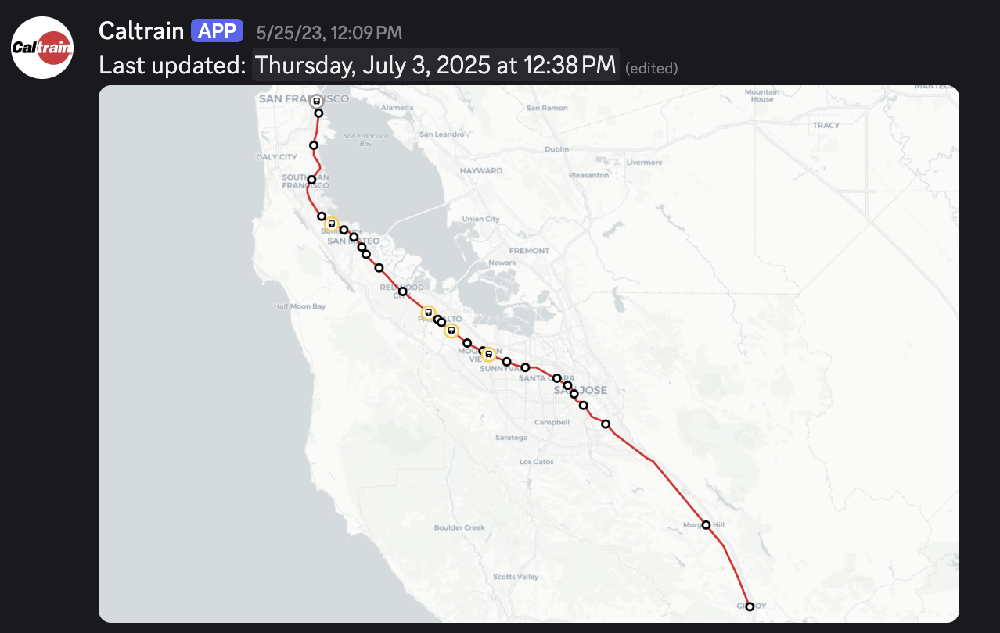

# Caltrain Twitter Alerts

**NOTE:** Twitter is now requiring developers to pay money in order to get tweets using their API, so unfortunately the realtime updates do not work anymore.

A discord bot that uses Twitter to pull realtime updates for trains, plus mapping and scheduling!
  
  
